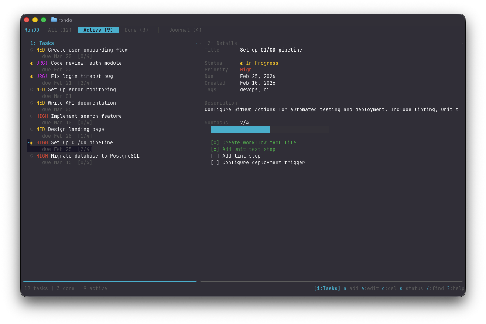
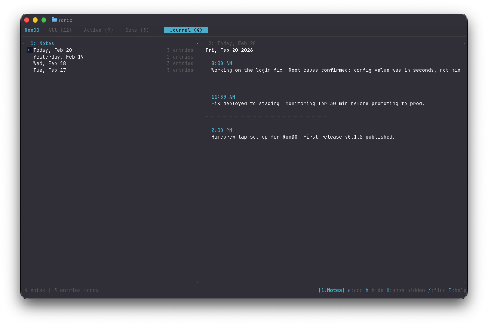

<h1 align="center">
  RonDO
</h1>

<p align="center">
  <strong>A modern terminal productivity app that combines task management with a daily journal.</strong>
</p>

<p align="center">
  <a href="https://github.com/roniel-rhack/rondo/releases/latest"></a>
  <a href="https://github.com/roniel-rhack/rondo/blob/main/LICENSE"></a>
  <a href="https://go.dev/"></a>
</p>

<p align="center">
  Fast, keyboard-driven, and built with Go and the <a href="https://charm.sh">Charm</a> ecosystem.
</p>

---

<p align="center">
  
</p>

<p align="center">
  
</p>

---

## Install

### Homebrew

```bash
brew tap roniel-rhack/tap
brew install rondo
```

### From source

```bash
git clone https://github.com/roniel-rhack/rondo.git
cd rondo
go build -o rondo ./cmd/todo
mv rondo /usr/local/bin/
```

## Features

### Task Management

- **Full CRUD** with validated forms
- **Subtasks** with completion tracking and progress bar
- **Status workflow** — Pending, In Progress, Done
- **Priority levels** — Low, Medium, High, Urgent (color-coded)
- **Due dates** with sort support
- **Tags** for organization
- **Sorting** by creation date, due date, or priority (`F1`/`F2`/`F3`)
- **Fuzzy search** — filter tasks with `/`

### Daily Journal

- **One note per day** — auto-created on first entry
- **Timestamped entries** — each entry records the time
- **Edit & delete entries** — cursor-based selection
- **Hide/restore notes** — archive without deleting
- **Smart date labels** — "Today", "Yesterday", weekday names

### Interface

- **Two-panel layout** — list + detail with `1`/`2` focus switching
- **Four tabs** — All, Active, Done, Journal (live counts)
- **Vim-style navigation** — `j`/`k` everywhere
- **Context-sensitive status bar** — keybinding hints update per panel
- **Modal forms** — Huh-powered with Dracula theme
- **Confirmation dialogs** for all destructive actions
- **Help overlay** — `?` for full keybinding reference

## Keyboard Shortcuts

### Global

| Key | Action |
|-----|--------|
| `Tab` | Switch tabs |
| `1` / `2` | Focus left / right panel |
| `Esc` | Return to list / clear filter |
| `?` | Help overlay |
| `q` | Quit |

### Tasks — Panel 1

| Key | Action |
|-----|--------|
| `j`/`k` | Navigate |
| `a` | Add task |
| `e` | Edit task |
| `d` | Delete task |
| `s` | Cycle status |
| `t` | Add subtask |
| `/` | Search |
| `F1`/`F2`/`F3` | Sort by created / due / priority |

### Tasks — Panel 2 (Details)

| Key | Action |
|-----|--------|
| `j`/`k` | Navigate subtasks |
| `a` | Add subtask |
| `e` | Edit subtask |
| `d` | Delete subtask |
| `s` | Toggle subtask |

### Journal — Panel 1 (Notes)

| Key | Action |
|-----|--------|
| `j`/`k` | Navigate notes |
| `a` | Add entry (today) |
| `h` | Hide / restore note |
| `H` | Toggle show hidden |
| `/` | Search notes |

### Journal — Panel 2 (Entries)

| Key | Action |
|-----|--------|
| `j`/`k` | Navigate entries |
| `a` | Add entry (today) |
| `e` | Edit entry |
| `d` | Delete entry |

## Architecture

```
cmd/todo/main.go                # Entry point
internal/
  app/
    model.go                    # Main Bubbletea Model + Update + View
    model_journal.go            # Journal tab handlers
    keys.go                     # Keybinding definitions
    styles.go                   # Lip Gloss styles
    delegate.go                 # Task list item delegate
    delegate_journal.go         # Journal note list item delegate
  database/
    db.go                       # SQLite connection setup
  journal/
    journal.go                  # Note & Entry domain types
    store.go                    # Journal SQLite repository
  task/
    task.go                     # Task & Subtask domain types
    store.go                    # Task SQLite repository
  ui/
    colors.go                   # Shared color palette
    views.go                    # Rendering (tabs, detail, status bar, dialogs)
    form.go                     # Huh form builders
```

Follows the **Bubbletea MVU** (Model-Update-View) pattern. All data persists in a single SQLite database at `~/.todo-app/todo.db` (WAL mode, single connection, `ON DELETE CASCADE`).

## Development

```bash
go build ./cmd/todo     # Build
go run ./cmd/todo       # Run
go test ./...           # Test
go vet ./...            # Vet
go mod tidy             # Tidy deps
```

## Built With

[Bubbletea](https://github.com/charmbracelet/bubbletea) ·
[Bubbles](https://github.com/charmbracelet/bubbles) ·
[Lip Gloss](https://github.com/charmbracelet/lipgloss) ·
[Huh](https://github.com/charmbracelet/huh) ·
[modernc.org/sqlite](https://pkg.go.dev/modernc.org/sqlite)

## License

[MIT](LICENSE)
